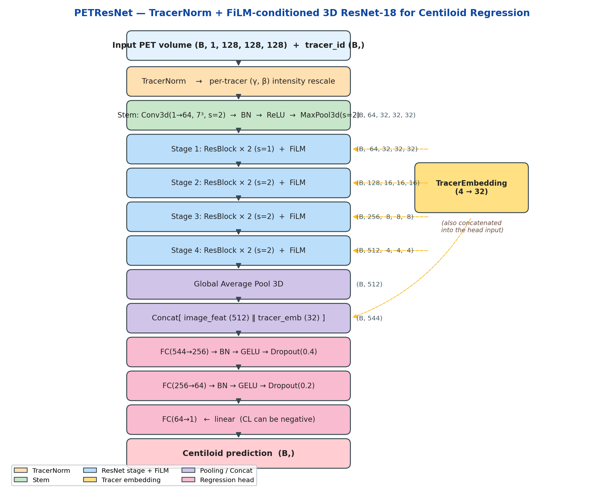

<p align="center">
  
</p>

<h1 align="center">MYGO-Centiloid</h1>

<p align="center">
  <b>M</b>ultitracer-conditioned 3D res<b>N</b>et for am<b>Y</b>loid β-PET centil<b>O</b>id re<b>G</b>ression
</p>

<p align="center">
  <a href="https://www.python.org/downloads/"></a>
  <a href="https://pytorch.org/"></a>
  <a href="https://medaihack.org/"></a>
  <a href="https://opensource.org/licenses/MIT"></a>
</p>

---

Team25 **It's MYGO!!!!!!** · **1st prize** at the **MedAI Spring 2026 Hackathon** organized by the Kolachalama Lab, Boston University — <https://github.com/vkola-lab/medaihack>.

<p align="center">
  
</p>

We predict continuous Centiloid scores from preprocessed 3D amyloid β-PET
volumes (`(1, 128, 128, 128)`, four tracers: **FBP**, **FBB**, **NAV**, **PIB**), trained on the MedAI Spring 2026 Hackathon data (2,000 train + 500 val, NACC + A4 cohorts). The pipeline is specifically designed to handle the extreme right-skew and 64.8 % negative-class imbalance in the Centiloid distribution.

Our model `PETResNet` combines:
- **TracerNorm** — per-tracer learned (γ, β) intensity rescale at the input;
- a **3D ResNet-18** backbone with **FiLM** conditioning at every residual stage;
- a **tracer embedding** concatenated into our 3-layer regression head;
- a **Huber + Pearson** combined loss trained with an inverse-frequency
  `WeightedRandomSampler` over six Centiloid bins.

We motivated every design decision with an empirical finding, documented
in [`eda/`](eda/README.md) and recorded in each script's `Justifies:` header.

## Overview

Predict **centiloid scores** from preprocessed 3D amyloid PET brain scans. Centiloid is a standardized quantitative measure of amyloid-beta plaque burden in the brain and is a key biomarker for Alzheimer's disease. Higher centiloid values indicate greater amyloid deposition.

**Task:** Given a preprocessed 3D PET volume and the radiotracer used, predict the continuous centiloid score.

## Repository Structure

```text
MYGO/
├── abpet/                        # Installable package
│   ├── __init__.py                   re-exports public API
│   ├── model/
│   │   └── petresnet.py              PETResNet, BaselineCNN, TracerNorm, FiLMBlock
│   ├── nn/
│   │   └── losses.py                 CentiloidLoss, get_criterion
│   └── data/
│       ├── dataset.py                PETDataset
│       └── augmentation.py           build_train_transform (per-tracer strength)
│
├── dev/                          # Runnable scripts + launcher + config
│   ├── train.py                      AMP training loop, weighted sampler, CosineWR
│   ├── predict.py                    loads checkpoint, writes predictions.csv
│   ├── evaluate.py                   compares predictions vs ground truth
│   ├── train.sh                      launcher (forwards env + CLI flags)
│   └── config/default.toml           hyperparameter defaults
│
├── eda/                          # EDA suite — see eda/README.md
│   ├── _common.py, 01_*.py, 02_*.py, 03_*.py, 04_*.py
│   └── README.md
│
├── figures/                      # Hero diagram embedded in this README
│   └── architecture.png
├── pseudodata/                   # 4 synthetic samples (1 per tracer) for the demo
├── checkpoints/                  # Created at train time (best_model.pt / last_model.pt)
│
├── demo_inference.py             # Root-level reviewer entry point
├── predict.sh                    # Root-level judge entry point → dev/predict.py
├── setup.py                      # `pip install -e .` to make `abpet` importable
├── requirements.txt
└── README.md
```

After `pip install -e .`, the public API is:

```python
from abpet import PETResNet, PETDataset, CentiloidLoss, get_criterion, build_train_transform
```

## Quick demo

Verify a fresh checkout in under 5 seconds with the synthetic samples in
`pseudodata/`:

```bash
python demo_inference.py                                       # random init
python demo_inference.py --checkpoint checkpoints/best_model.pt  # trained
```

## Environment Setup

We developed MYGO on the BU SCC (`/projectnb/medaihack/team25/…`) under
the `medaihack/spring-2026` module. The commands below reproduce the
exact environment we used.

### First-time setup (one-off per team member)

```bash
module load medaihack/spring-2026
module load python3/3.12.4

virtualenv /projectnb/medaihack/team25/venv_name
source   /projectnb/medaihack/team25/venv_name/bin/activate

cd /projectnb/medaihack/team25/MYGO_MedAI/ABPET
pip install -r requirements.txt
pip install -e .                      # makes `abpet` importable
```

### Reusing the environment (every session)

```bash
module load medaihack/spring-2026
module load python3/3.12.4
source /projectnb/medaihack/team25/venv_name/bin/activate
```

For **OnDemand** (Jupyter / Code Server): load the two modules in the
module list, and place the `source` command in the pre-launch dialog box.
To expose the venv as a Jupyter kernel:

```bash
python -m ipykernel install --user --name venv_name --display-name "Python (venv_name)"
```

### Outside BU SCC

To run MYGO on another machine (Linux + CUDA 12.9 recommended):

```bash
git clone https://github.com/<your-user>/mygo-centiloid.git
cd mygo-centiloid
python -m venv .venv && source .venv/bin/activate
pip install -r requirements.txt
pip install -e .
python demo_inference.py              # 4-sample smoke test, <5 s
```

---

## Data

```text
/projectnb/medaihack/ABPET/
└── data/
    ├── npy_files/               # All .npy volumes
    ├── train.csv                # Training split (2,000 samples)
    └── val.csv                  # Validation split (500 samples)
```

| Split      | Cohorts   | N Samples | Description                                              |
| ---------- | --------- | --------- | -------------------------------------------------------- |
| Training   | NACC + A4 | 2,000     | 1,195 NACC + 805 A4 samples                              |
| Validation | NACC + A4 | 500       | 305 NACC + 195 A4 samples                                |

Each sample is a preprocessed `.npy` file with an associated centiloid score and tracer label.

### CSV Format

| Column       | Type  | Description                                            |
| ------------ | ----- | ------------------------------------------------------ |
| `npy_path`   | str   | Path to the preprocessed `.npy` file                   |
| `CENTILOIDS` | float | Target — amyloid burden score (typically 0–150+)       |
| `TRACER.AMY` | str   | Radiotracer used: `FBP`, `FBB`, `NAV`, `PIB`           |
| `ID`         | str   | Subject identifier                                     |

### Image Format

Each `.npy` file contains a single preprocessed PET volume:

* **Shape:** `(1, 128, 128, 128)` — 1 channel, 128³ voxels
* **Dtype:** `float32`
* **Value range:** `[0, 1]` (min-max normalized)

### Why Tracer Matters

The four tracers in this dataset are:

| Code  | Full name      |
| ----- | -------------- |
| `FBP` | Florbetapir    |
| `FBB` | Florbetaben    |
| `NAV` | Florbetanav    |
| `PIB` | Pittsburgh Compound B |

Each binds to amyloid with different affinity and produces different uptake patterns. The centiloid scale was designed to harmonize across tracers, but the raw images still differ by tracer. Your model should account for this — a tracer embedding is one common approach.

## Preprocessing Already Applied

All images have been preprocessed from raw NIfTI PET scans. The following transformations were applied **in order** (you do **not** need to redo any of these):

### 1. Ensure Channel First

Converts the loaded NIfTI image to `(C, H, W, D)` format, where `C` is the channel dimension.

### 2. Orientation to RAS

Reorients the image to **RAS** (Right-Anterior-Superior) standard neuroimaging orientation. This ensures consistent spatial alignment across subjects and scanners.

### 3. Isotropic Resampling to 2mm

Resamples the image to **2mm × 2mm × 2mm isotropic voxel spacing** using trilinear interpolation. Raw PET scans vary widely in resolution across scanners and protocols — this standardizes the spatial scale.

### 4. Foreground Cropping

Removes background voxels (air/zero-padding outside the brain) with a 10-voxel margin using MONAI's `CropForeground`. This reduces unnecessary empty space.

### 5. Resize to 128³

Resizes the cropped volume to a fixed `128 × 128 × 128` spatial size using trilinear interpolation. This guarantees uniform input dimensions for the network.

### 6. Spatial Padding

Pads to exactly `128 × 128 × 128` if the resize output is slightly smaller (safety step).

### 7. Dynamic Frame Averaging

Some PET scans have multiple temporal frames (dynamic acquisitions). If multiple frames exist, they are averaged into a single static volume. This produces a single `(1, 128, 128, 128)` output.

### 8. Shape Enforcement

A final safety check centers and crops/pads the volume to ensure the exact output shape `(1, 128, 128, 128)`.

### 9. Min-Max Normalization to [0, 1]

Each volume is independently normalized to the `[0, 1]` range:

```python
img = (img - img.min()) / (img.max() - img.min())
```

## Getting Started

Before training, run the EDA suite once to inspect the distributions and
verify the four design assumptions (skew, class balance, tracer drift,
sample-count imbalance). See `eda/README.md` for the full runbook.

```bash
# Quick look — full EDA sweep
for s in eda/[0-9][0-9]_*.py; do python "$s" || exit 1; done
```

**Interactive (OnDemand terminal):**

```bash
cd /projectnb/medaihack/YOUR_TEAM/medaihack/ABPET
source /projectnb/medaihack/YOUR_TEAM/venv_name/bin/activate
pip install -e .                                       # makes `abpet` importable

# Train (per-tracer augmentation enabled by default; --no_augment to disable)
bash dev/train.sh                                      # uses dev/config/default.toml
#   or equivalently:
python dev/train.py \
    --train_csv /projectnb/medaihack/ABPET/data/train.csv \
    --val_csv   /projectnb/medaihack/ABPET/data/val.csv

# Predict
python dev/predict.py \
    --csv /projectnb/medaihack/ABPET/data/val.csv \
    --checkpoint checkpoints/best_model.pt \
    --output predictions.csv

# Evaluate
python dev/evaluate.py --pred predictions.csv --gt /projectnb/medaihack/ABPET/data/val.csv
```

## Pipeline

```text
Preprocessed 3D amyloid PET volumes (.npy)
(shape: 1 x 128 x 128 x 128, float32, normalized to [0,1])
+ metadata from train.csv / val.csv
(columns: ID, npy_path, CENTILOIDS, TRACER.AMY)
            |
            v
dataset.py        --->  load PET volume + tracer label + centiloid target
                        per-tracer transform dispatch
            |
            v
augmentation.py   --->  3D RandAffine + RandFlipLR + RandGamma
                        + RandBiasShift + RandGaussianNoise
                        (STRONG strength for NAV / PIB; standard for FBP / FBB)
            |
            v
model.py          --->  TracerNorm  (per-tracer learned γ, β)
                        + 3D ResNet-18 backbone
                        + FiLM at every stage (tracer-conditioned)
                        + regression head (no output activation)
            |
            v
losses.py         --->  CentiloidLoss = α·Huber(δ=25) + (1−α)·(1 − Pearson r)
                        (also: huber / mse / mae via --loss)
            |
            v
train.py          --->  AdamW + CosineAnnealingWarmRestarts(T_0=20, T_mult=2)
                        WeightedRandomSampler (6 CL bins, inverse frequency)
                        AMP + gradient clipping
                        outputs:
                          checkpoints/best_model.pt   (lowest val MAE)
                          checkpoints/last_model.pt   (most recent)
                          console: train loss, val MAE, Pearson r, LR
            |
            v
predict.py        --->  predictions.csv
                        columns: ID, npy_path, TRACER.AMY, PREDICTED_CENTILOIDS
            |
            v
evaluate.py       --->  console: MSE / RMSE / MAE / Pearson r,
                        overall and per tracer
```

## Outputs

After training the following files are created automatically:

| File | Description |
| ---- | ----------- |
| `checkpoints/best_model.pt` | Best model weights (lowest val MAE), with `tracer_map`, `num_tracers`, `emb_dim`, `dropout_high`, `dropout_low` for downstream `predict.py` |
| `checkpoints/last_model.pt` | Most recent epoch checkpoint |

After running `eda/[0-9][0-9]_*.py`:

| File | Description |
| ---- | ----------- |
| `results/eda/<script>/*.png` | Figures for each EDA question |
| `results/eda/<script>/*.txt` | Per-script summary report (auditable numbers) |

After running `predict.py` and `evaluate.py`:

| File | Description |
| ---- | ----------- |
| `predictions.csv` | Columns: `ID`, `npy_path`, `TRACER.AMY`, `PREDICTED_CENTILOIDS` |
| (console) `evaluate.py` | MSE / RMSE / MAE / Pearson r — overall and per tracer |

## Results

We compared our `PETResNet` against the unmodified starter baseline on
the validation set. Our goal was to improve MAE across all tracers while
preserving Pearson r on the small NAV subset.

**Starter baseline** (unmodified, for reference):

| Tracer | N | MAE (CL) | Pearson r |
| ------ | --- | -------- | --------- |
| **ALL** | 500 | 19.77 | 0.790 |
| FBP | 236 | 19.28 | 0.797 |
| FBB | 114 | 20.04 | 0.804 |
| PIB | 133 | 21.17 | 0.790 |
| NAV | 17  | 13.86 | 0.946 |

**MYGO — ours** (to fill in with final numbers):

| Tracer | N | MAE (CL) | Pearson r |
| ------ | --- | -------- | --------- |
| **ALL** | 500 | **_TBD_** | **_TBD_** |
| FBP | 236 | _TBD_ | _TBD_ |
| FBB | 114 | _TBD_ | _TBD_ |
| PIB | 133 | _TBD_ | _TBD_ |
| NAV | 17  | _TBD_ | _TBD_ |

## Evaluation

Our model was evaluated on the held-out test set with the judge harness:

```bash
bash predict.sh <test.csv> <checkpoint.pt> predictions.csv
```

We reproduced our validation numbers with:

```bash
cd /projectnb/medaihack/team25/MYGO_MedAI/ABPET
source /projectnb/medaihack/team25/venv_name/bin/activate
python dev/predict.py \
    --csv /projectnb/medaihack/ABPET/data/val.csv \
    --checkpoint checkpoints/best_model.pt \
    --output predictions.csv
python dev/evaluate.py --pred predictions.csv \
    --gt /projectnb/medaihack/ABPET/data/val.csv
```

`dev/predict.py` writes a CSV with the `PREDICTED_CENTILOIDS` column. Our
trained weights live at `checkpoints/best_model.pt`, loaded by both
`predict.sh` (judge harness) and `demo_inference.py` (reviewer smoke test).

Scoring metrics used by the judges:

* **Primary:** Mean Absolute Error (MAE) in centiloid units
* **Secondary:** Pearson correlation coefficient between predicted and true centiloid scores

## References

Citations for the prior work that directly informed each MYGO component.

### Architecture

1. **He K, Zhang X, Ren S, Sun J.** Deep Residual Learning for Image
   Recognition. *CVPR* 2016. — the 2D ResNet-18 backbone we extend to 3D.
   [arXiv:1512.03385](https://arxiv.org/abs/1512.03385)
2. **Hara K, Kataoka H, Satoh Y.** Can Spatiotemporal 3D CNNs Retrace the
   History of 2D CNNs and ImageNet? *CVPR* 2018. — empirical basis for
   using 3D ResNets on volumetric data at our scale.
   [arXiv:1711.09577](https://arxiv.org/abs/1711.09577)
3. **Perez E, Strub F, de Vries H, Dumoulin V, Courville A.** FiLM:
   Visual Reasoning with a General Conditioning Layer. *AAAI* 2018. —
   the `FiLMBlock` at every ResNet stage (tracer-conditioned γ, β).
   [arXiv:1709.07871](https://arxiv.org/abs/1709.07871)
4. **Dumoulin V, Shlens J, Kudlur M.** A Learned Representation for
   Artistic Style. *ICLR* 2017. — conditional instance normalization,
   the conceptual precursor to our input-level `TracerNorm`.
   [arXiv:1610.07629](https://arxiv.org/abs/1610.07629)

### Loss and optimization

5. **Huber PJ.** Robust Estimation of a Location Parameter. *Annals of
   Mathematical Statistics* 1964;35(1):73–101. — Huber term in
   `CentiloidLoss` with `δ=25` ≈ Centiloid IQR.
6. **Loshchilov I, Hutter F.** Decoupled Weight Decay Regularization
   (AdamW). *ICLR* 2019.
   [arXiv:1711.05101](https://arxiv.org/abs/1711.05101)
7. **Loshchilov I, Hutter F.** SGDR: Stochastic Gradient Descent with
   Warm Restarts. *ICLR* 2017. — `CosineAnnealingWarmRestarts(T_0=20, T_mult=2)`.
   [arXiv:1608.03983](https://arxiv.org/abs/1608.03983)
8. **Micikevicius P, et al.** Mixed Precision Training. *ICLR* 2018. —
   AMP autocast + GradScaler in `dev/train.py`.
   [arXiv:1710.03740](https://arxiv.org/abs/1710.03740)
9. **Buda M, Maki A, Mazurowski MA.** A systematic study of the class
   imbalance problem in convolutional neural networks.
   *Neural Networks* 2018;106:249–259. — motivation for our six-bin
   `WeightedRandomSampler` on Centiloid.

### Medical-imaging augmentation

10. **Pérez-García F, Sparks R, Ourselin S.** TorchIO: a Python library
    for efficient loading, preprocessing, augmentation and patch-based
    sampling of medical images in deep learning. *Computer Methods and
    Programs in Biomedicine* 2021;208:106236. — reference for
    per-tracer-strength 3D augmentation choices in
    `abpet/data/augmentation.py`.
    [doi:10.1016/j.cmpb.2021.106236](https://doi.org/10.1016/j.cmpb.2021.106236)

### Domain — amyloid PET and the Centiloid scale

11. **Klunk WE, et al.** The Centiloid Project: standardizing
    quantitative amyloid plaque estimation by PET. *Alzheimer's &
    Dementia* 2015;11(1):1–15. — the regression target; source of the
    positivity threshold (24.4 CL) used throughout `eda/`.
    [doi:10.1016/j.jalz.2014.07.003](https://doi.org/10.1016/j.jalz.2014.07.003)
12. **Jagust WJ, et al.** The Alzheimer's Disease Neuroimaging Initiative
    2 PET Core: 2015. *Alzheimer's & Dementia* 2015;11(7):757–771. —
    reference preprocessing pipeline for amyloid PET.
    [doi:10.1016/j.jalz.2015.05.001](https://doi.org/10.1016/j.jalz.2015.05.001)

### Related Kolachalama Lab work

13. **Qiu S, et al.** Multimodal deep learning for Alzheimer's disease
    dementia assessment. *Nature Communications* 2022;13:3404. — the
    lab's 3D-CNN + fusion precedent for structural brain imaging.
    [doi:10.1038/s41467-022-31037-5](https://doi.org/10.1038/s41467-022-31037-5)
    · [vkola-lab/ncomms2022](https://github.com/vkola-lab/ncomms2022)
14. **Kolachalama Lab.** AI-driven fusion of multimodal data for
    Alzheimer's disease biomarker assessment. *Nature Communications*
    2025. — the lab's current amyloid/τ multimodal framework; its
    `image_processing/pet_pipeline.sh` is the upstream amyloid-PET
    reference pipeline.
    [doi:10.1038/s41467-025-62590-4](https://doi.org/10.1038/s41467-025-62590-4)
    · [vkola-lab/ncomms2025](https://github.com/vkola-lab/ncomms2025)